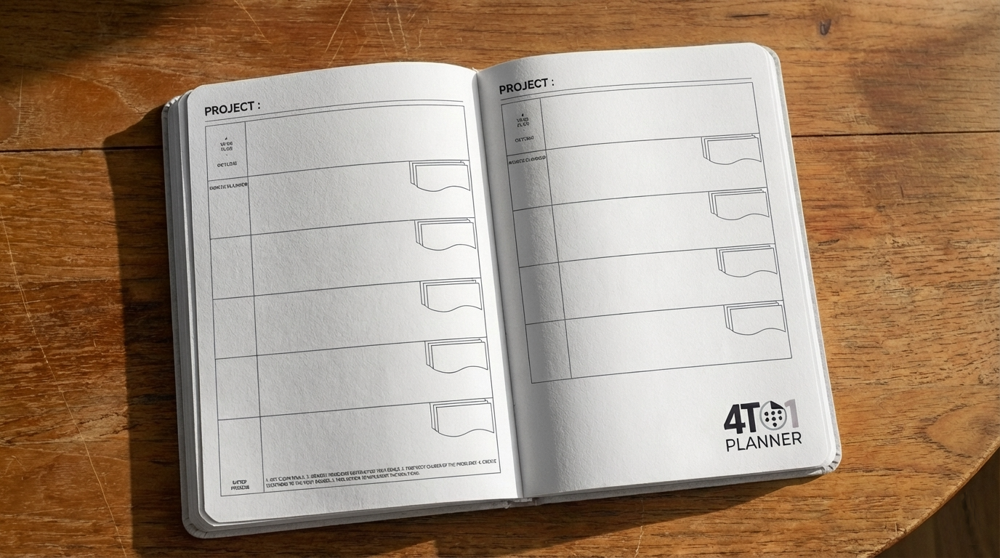
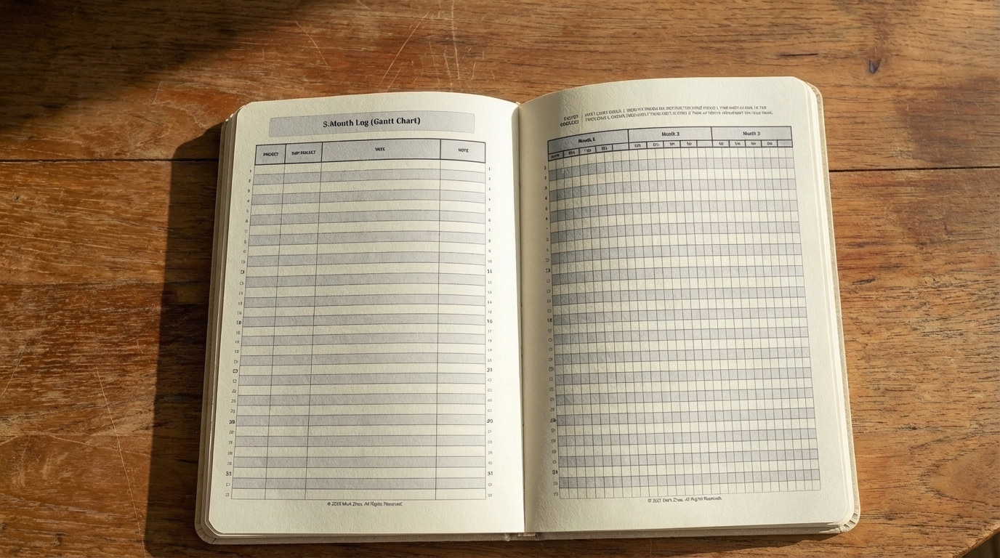
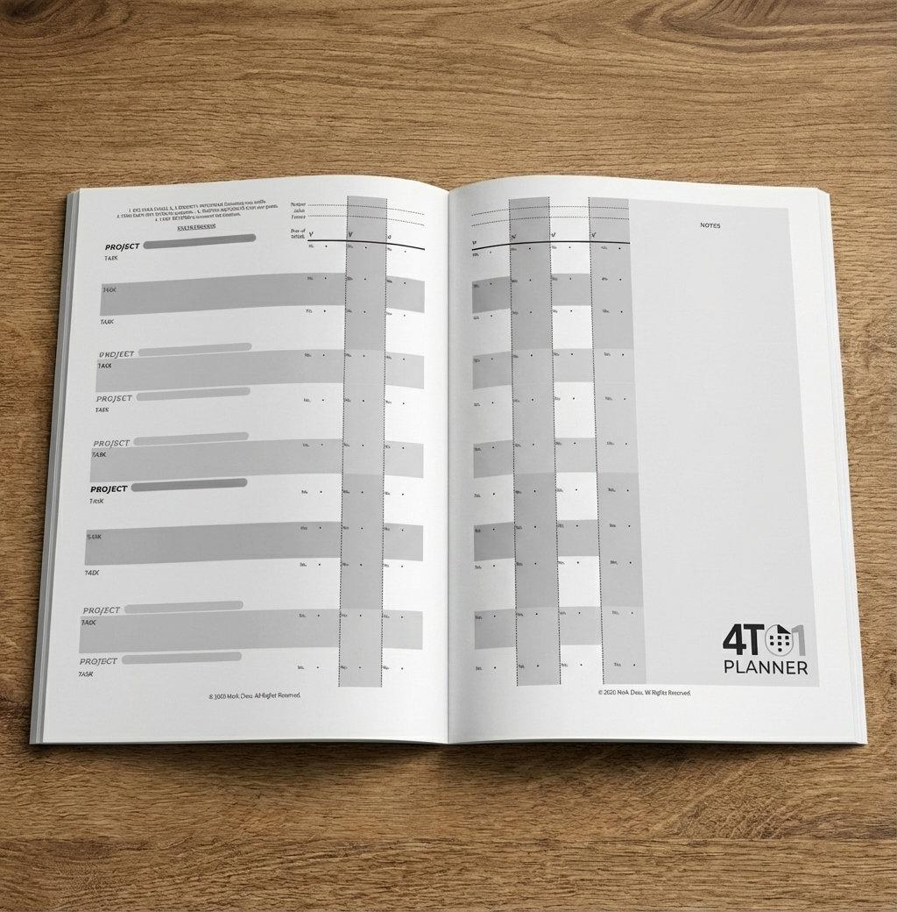

# 📅 The 4to1 Planner System

### *From 4 Years to 1 Day* | *从四年到一天*

[](https://creativecommons.org/licenses/by-nc-sa/4.0/)
[](https://github.com/qingxuantang/4to1-planner/stargazers)
[](https://github.com/qingxuantang/4to1-planner/network/members)
[](https://github.com/qingxuantang/4to1-planner/issues)
[](https://github.com/qingxuantang/4to1-planner/commits/main)

> A comprehensive productivity planning system that bridges your long-term vision with daily execution.

[English](#english) | [中文](#中文)

---

## English

### 🌟 What is The 4to1 Planner?

The 4to1 Planner is a **free, open-source productivity system** designed to help you plan and execute your goals across four time horizons:

- 🔵 **4 Years** - Your long-term strategic vision
- 🟢 **3 Months** - Quarterly milestones with Gantt-style tracking
- 🟠 **2 Weeks** - Weekly action tracking with progress bars
- 🔴 **1 Day** - Daily focused execution

Inspired by **Ray Dalio's 5-Step Process** and refined over **6 years of real-world use**, this system combines the best of analog planning with project management methodologies.

### ✨ Key Features

- 📊 **Gantt Charts for Personal Use** - Visual timeline tracking for your projects
- ✅ **1 Day in a Week Tracking Sheet** - Gamified progress bars in 15% increments
- 🚫 **Not-To-Do List** - Negative task management inspired by Warren Buffett's "The Snowball" (avoid time wasters!) 
- 🎯 **Four-Year Strategic Plan** - The longest planning horizon in personal planners
- 🌏 **Bilingual Design** - Full English and Chinese support
- 🖨️ **Print-Ready PDFs** - Optimized for A4 printing with proper bleed settings
- 📝 **Customizable** - Source files available for personal modifications

### 📦 What's Included (FREE)

This repository contains everything you need to get started:

```
Printable-pdfs/Free/
├── 4-Year Plan.pdf (+ Cover)
├── 3-Month Log.pdf (+ Cover)
├── 1 Day in a Week.pdf (+ Cover)
├── To-Do List.pdf
├── Not-To-Do Projects.pdf
├── Notes.pdf
├── Blank Page.pdf
├── 4To1 Planner Cover.pdf
└── All-in-One 4To1 Planner.pdf
```

### 🚀 How to Get Started

1. **Download** the PDFs from the [`Printable-pdfs/Free/`](/Printable-pdfs/Free/) folder
2. **Print** on A4 paper (recommended: 100gsm for best quality)
3. **Bind** using your preferred method:
   - Hole punch + ring binder
   - Disc-bound system
   - Spiral binding at a print shop
4. **Start planning** your next 4 years!

**Quick Start Guide:**
1. Begin with the **4-Year Plan** - Define your long-term vision
2. Break it down in the **3-Month Log** - Set quarterly milestones
3. Use the **1 Day in a Week Tracking Sheet** - Track your daily progress
4. Review and adjust regularly

### 🎨 Design Philosophy

The 4To1 Method uses a **4-color progression** that corresponds to time horizons:

- **Vision Blue** 🔵 - 4 Years (Strategic thinking)
- **Growth Green** 🟢 - 3 Months (Milestones)
- **Action Orange** 🟠 - 2 Weeks (Execution)
- **Focus Red** 🔴 - 1 Day (Immediate action)

This color coding helps you stay oriented in time and prioritize effectively.

### 🎯 Who Is This For?

- **Strategic Professionals** seeking long-term planning tools
- **Project Managers** wanting analog backup systems
- **Students & Researchers** managing multi-year projects (PhD, thesis)
- **Entrepreneurs** building businesses with clear roadmaps
- **Anyone** tired of digital fatigue and seeking screen-free productivity

### 💡 Why Analog Planning?

In our hyper-digital world, putting pen to paper:
- Reduces screen fatigue and digital distractions
- Improves memory retention through kinesthetic learning
- Creates tangible progress you can see and feel
- Allows for creative flexibility without software constraints
- Works offline, always accessible, no batteries required

### 🌐 Community & Support

- **Website**: [4to1planner.com](https://4to1planner.com)
- **Questions?** Open an [Issue](../../issues)
- **Success Stories**: We'd love to hear how you use the 4To1 Method!
- **Notion Templates**: Available for digital integration

### 📚 Documentation

Explore the [`plans/`](/plans/) folder for:
- Detailed SKU definitions
- Product catalog
- Visual design system
- Launch strategy (for those interested in the business side)

### 🙏 Giving Back

If this system helps you, consider:
- ⭐ **Starring this repository** to help others discover it
- 📢 **Sharing** with friends who struggle with planning
- 💬 **Contributing** improvements or translations (see [CONTRIBUTING.md](CONTRIBUTING.md))
- ☕ **Supporting** the premium versions to sustain development

### 🔓 License

This project is licensed under [**CC BY-NC-SA 4.0**](LICENSE):
- ✅ **Free to use** for personal, non-commercial purposes
- ✅ **Modify and adapt** to your needs
- ✅ **Share** with attribution
- ❌ **Cannot sell** or use commercially without permission

For commercial licensing options, visit [4to1planner.com](https://4to1planner.com)

See the [LICENSE](LICENSE) file for full legal terms.

© 2025 4to1 Planner. All Rights Reserved.

---

### 🎁 Want More?

The free version is just the beginning! Check out our premium offerings:

- 🎨 **Premium Color Themes** - Minimalist, Corporate, Creative designs
- 💻 **Digital Ecosystem Bundle** - Notion, Obsidian, Excel templates
- 📖 **Physical Planners** - Professionally printed and bound
- 🎓 **Strategic Planning Academy** - Learn to master the 4to1 Method™

Visit [4to1planner.com](https://4to1planner.com) to explore premium products.

---

## 中文

### 🌟 什么是肆壹手账？

肆壹手账是一个**免费开源的生产力系统**，旨在帮助您跨越四个时间维度规划和执行目标：

- 🔵 **4年** - 您的长期战略愿景
- 🟢 **3个月** - 带甘特图风格跟踪的季度里程碑
- 🟠 **2周** - 带进度条的周行动跟踪
- 🔴 **1天** - 日常集中执行

受**雷·达里奥五步流程**启发，经过**6年实际使用**打磨，该系统结合了模拟规划和项目管理方法论的精华。

### ✨ 核心功能

- 📊 **个人甘特图** - 项目的可视化时间线跟踪
- ✅ **周跟踪表（1 Day in a Week）** - 15%增量的游戏化进度条
- 🚫 **避免事项清单** - 革命性的负面任务管理（避免时间浪费！）
- 🎯 **四年战略计划** - 个人规划器中最长的规划期限
- 🌏 **双语设计** - 完整的英文和中文支持
- 🖨️ **可打印PDF** - 为A4打印优化，带正确出血设置
- 📝 **可定制** - 提供源文件供个人修改

### 📦 免费内容

此仓库包含您入门所需的一切：

```
Printable-pdfs/Free/
├── 4-Year Plan.pdf（4年计划 + 封面）
├── 3-Month Log.pdf（3月日志 + 封面）
├── 1 Day in a Week.pdf（一周中的一天 + 封面）
├── To-Do List.pdf（待办清单）
├── Not-To-Do Projects.pdf（避免事项清单）
├── Notes.pdf（笔记）
├── Blank Page.pdf（空白页）
├── 4To1 Planner Cover.pdf（4To1规划器封面）
└── All-in-One 4To1 Planner.pdf（多合一4To1规划器）
```

### 🚀 如何开始

1. **下载** [`Printable-pdfs/Free/`](/Printable-pdfs/Free/) 文件夹中的PDF
2. **打印** 在A4纸上（推荐：100克纸张以获得最佳质量）
3. **装订** 使用您喜欢的方法：
   - 打孔器 + 活页夹
   - 圆盘装订系统
   - 在打印店螺旋装订
4. **开始规划** 您的未来4年！

**快速入门指南：**
1. 从**4年计划**开始 - 定义您的长期愿景
2. 在**3月日志**中细化 - 设定季度里程碑
3. 使用**周跟踪表（1 Day in a Week）** - 跟踪您的日常进度
4. 定期审查和调整

### 🎨 设计理念

“4To1方法”使用**四色渐进**对应时间维度：

- **愿景蓝** 🔵 - 4年（战略思考）
- **成长绿** 🟢 - 3个月（里程碑）
- **行动橙** 🟠 - 2周（执行）
- **专注红** 🔴 - 1天（即时行动）

这种颜色编码帮助您保持时间定向并有效排序优先级。

### 🎯 适用人群

- **战略专业人士** 寻求长期规划工具
- **项目经理** 想要模拟备份系统
- **学生与研究人员** 管理多年项目（博士、论文）
- **创业者** 用清晰路线图构建业务
- **任何人** 厌倦数字疲劳并寻求无屏幕生产力

### 💡 为什么选择纸质规划？

在超数字化世界中，纸笔书写：
- 减少屏幕疲劳和数字干扰
- 通过动觉学习提高记忆保留
- 创造您可以看到和感受到的具体进展
- 允许创意灵活性而无需软件限制
- 离线工作，始终可访问，无需电池

### 🌐 社区与支持

- **网站**：[4to1planner.com](https://4to1planner.com)
- **问题？** 提交[Issue](../../issues)
- **成功故事**：我们很想听听您如何使用4to1系统！
- **Notion模板**：可用于数字集成

### 🙏 回馈社区

如果此系统对您有帮助，请考虑：
- ⭐ **为此仓库加星** 帮助他人发现它
- 📢 **分享** 给在规划方面遇到困难的朋友
- 💬 **贡献** 改进或翻译（查看 [CONTRIBUTING.md](CONTRIBUTING.md)）
- ☕ **支持** 高级版本以维持开发

### 🔓 许可证

本项目采用 [**CC BY-NC-SA 4.0**](LICENSE) 许可：
- ✅ **免费使用** 个人非商业用途
- ✅ **修改和适应** 您的需求
- ✅ **分享** 需注明出处
- ❌ **不能销售** 或未经许可用于商业用途

商业许可选项，请访问 [4to1planner.com](https://4to1planner.com)

完整法律条款请查看 [LICENSE](LICENSE) 文件。

© 2025 4to1 Planner. 版权所有。

---

### 🎁 想要更多？

免费版本只是开始！查看我们的高级产品：

- 🎨 **高级彩色主题** - 极简、企业、创意设计
- 💻 **数字生态系统套装** - Notion、Obsidian、Excel模板
- 📖 **实体规划器** - 专业印刷和装订
- 🎓 **战略规划学院** - 学习掌握4to1方法™

访问 [4to1planner.com](https://4to1planner.com) 探索高级产品。

---

## 📸 Preview | 预览

### 🔵 4-Year Strategic Plan | 四年战略计划
*Define your long-term vision with clear milestones | 用清晰的里程碑定义您的长期愿景*



---

### 🟢 3-Month Gantt Log | 三月甘特图日志
*Track quarterly progress with visual timelines | 用可视化时间线跟踪季度进展*



---

### 🟠 1 Day in a Week Tracking Sheet | 周跟踪表
*Gamified weekly task tracking with progress bars | 带进度条的游戏化周任务跟踪*



---

## 🤝 Contributing | 贡献

We welcome contributions! Whether it's:
- 🐛 Bug reports
- 💡 Feature suggestions
- 🌍 Translations to other languages
- 📖 Documentation improvements

Please open an issue or submit a pull request.

欢迎贡献！无论是：
- 🐛 错误报告
- 💡 功能建议
- 🌍 翻译成其他语言
- 📖 文档改进

请提交issue或pull request。

---

## 🗺️ Roadmap | 路线图

- [x] Open-source FREE tier release
- [x] Add preview images to README
- [ ] Create video tutorials
- [ ] Notion-based planner support
- [ ] Community templates gallery

---

## 💬 Testimonials | 用户评价

> "I've been using the 4To1 Method for 6 years. It transformed how I think about goals - not as annual resolutions, but as multi-year journeys."
> *- Creator of the system | Mark Zhou*

**Have your own success story?** Share it by opening an issue with the "testimonial" label!

**有您自己的成功故事吗？** 通过使用"testimonial"标签提交issue来分享！

---

## 🔗 Links | 链接

- 🌐 **Official Website** | **官方网站**: [4to1planner.com](https://4to1planner.com)
- 📘 **Facebook**: Coming soon
- 📸 **Instagram**: Coming soon
- 🐦 **Twitter**: Coming soon
- 💼 **LinkedIn**: Coming soon

---

**Built with ❤️ and refined over 6 years of real-world planning**

**用❤️构建，经过6年真实世界规划的打磨**

---

*Last Updated: 2025-12-02*
